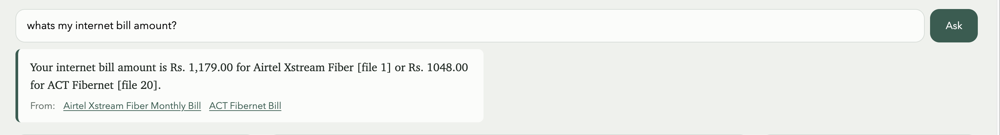

# SnapSort: an offline Gemma 4 agent for the documents you'd never upload

*Track: **Personal data**. Sense, decide, act, check, entirely on your laptop, with a clear line for when it asks you.*

Code: https://github.com/PavitarSinghArneja/gDeepMind_Hackathon

## The problem

Downloads and Screenshots folders fill up with bills, bank statements, payslips, lab reports, ID scans, WiFi passwords and OTPs. They're hard to find and too private for a cloud assistant. That is the Personal Data track's core problem: the model has to run where the documents are.

## What it does

SnapSort watches three folders. Each new file is read, classified, mined for key fields and filed under `library/<Category>/` with a consistent name. Due dates become reminders, secrets get a vault proposal, and anything sensitive or uncertain goes to a "Needs you" inbox. It never deletes and has no network tools. Its only traffic is to Ollama on `127.0.0.1`, and the UI shows the process's non-localhost connection count.

It uses three Gemma models through Ollama: **Gemma 4 E2B** triages and plans every file quickly; **Gemma 4 E4B** extracts fields, answers questions and gives a second opinion when E2B is under 80% sure; **EmbeddingGemma** indexes files for search by meaning.

In the UI, each inbox item has one button naming the action, every action offers Undo, each file shows its pipeline step by step, and expenses export to CSV.

## Meeting the bar

| Requirement | Where it lives |
|---|---|
| **Not a straight arrow** | A loop per file: checks can reject the model's output, escalate to E4B, roll back actions or hand off; your corrections change later runs (`agent/pipeline.py`) |
| **Local state management** | One SQLite file: task queue with per-stage checkpoints, action journal, inbox, rules, index (`taskq.py`, `tools.py`, `db.py`) |
| **Offline error recovery** | Resume after `kill -9`, journal reconciliation, model-down deferral, model fallback, rollback (`taskq.recover`, `tools.reconcile`) |
| **Clear human-handoff boundaries** | `config/policy.yaml`: auto / confirm / never, enforced in code by `agent/policy.gate` |

## Architecture

```
mock/{Downloads,Screenshots,Desktop} --watchdog + backlog scan-->
  tasks (SQLite: lease, per-stage checkpoint, attempts) --worker-->
  SENSE > DEDUPE > TRIAGE > EXTRACT > CHECK > PLAN > GATE > ACT > CHECK > INDEX
  OCR     hashes   Gemma    Gemma     code    Gemma  policy journal code   FTS5+vectors
                                              +code  .yaml
  events --SSE--> FastAPI 127.0.0.1:8765 <-- UI (inbox, library, per-file pipeline, ask, export)
  Ollama 127.0.0.1:11434 (gemma4:e2b triage/plan, gemma4:e4b extract/answer, embeddinggemma search)
```

## The agent loop in detail

1. **Sense.** PyMuPDF reads text; scanned PDFs and images are OCR'd with Tesseract (blurry ones enhanced and retried). Locked or corrupt files go straight to the inbox.
2. **Dedupe.** Identical SHA-256 files are auto-marked duplicates. A near match (dHash distance ≤ 6 *and* ≥ 80% text similarity) becomes a question for you.
3. **Triage.** E2B returns type, sensitivity, secret visibility, title and confidence as schema-constrained JSON. Invalid values fall back to safe defaults: unknown sensitivity becomes `high`.
4. **Extract.** E4B fills per-type fields such as amount, due date, vendor and test values. Off-spec keys are dropped.
5. **Check.** Deterministic verification (below).
6. **Plan.** Gemma picks tools from a fixed menu, giving reasons. Code fills exact arguments: folder, `<date>_<type>_<issuer>.<ext>`, reminder date. Unusable plans fall back to per-type defaults; learned rules apply next.
7. **Gate, act, check, index.** The policy gate sorts actions, tools run through the journal, postconditions are verified, and the file is indexed.

**Search and answers.** Keyword search (SQLite FTS5 with synonyms) and EmbeddingGemma vectors, merged by reciprocal-rank fusion, using EmbeddingGemma's query and document prompt formats. Answers must cite retrieved files or are shown as unverified; secrets stay blurred until clicked.



## Verification and safety

- **Grounding.** Extracted amounts, dates and reference numbers must appear in the normalised text (several numeric and month-name forms), or the file goes to the inbox. For near-textless files, Gemma checks whether the value is visible in the image.
- **Ambiguous dates.** A numeric-only date with day ≤ 12 fails the check with "could be 2026-10-03 or 2026-03-10; I assumed day/month", and the due date is editable in the inbox.
- **Prompt injection.** Prompts mark the document untrusted. A pattern check flags "ignore previous instructions" and sends the file to the inbox. A fooled model still can't delete, share or upload: those tools don't exist.
- **Allowlist gate.** The gate blocks and logs unlisted tools. Model-influenced folders outside `library/` are refused.
- **Rollback.** If a postcondition fails (file not at destination, reminder row missing), applied actions are undone in reverse order and the file goes to the inbox.
- **Encrypted vault.** Fernet, local 0600 key; plaintext removed only after ciphertext is written.

## Local state management

One SQLite file (WAL mode) holds files, tasks, journal, inbox, reminders, rules, events and the search index. Nothing lives only in memory.

- **Task leases.** A worker claims a task with a lease; if it dies, the lease expires and the task is reclaimed.
- **Checkpoints.** Each stage's output merges into the task checkpoint; on resume, finished stages (and their model calls) are skipped.
- **Journal before action.** Exact arguments are written as a `pending` row; the tool runs and the row becomes `applied` or `failed`. Resume uses the journal to decide what already ran.
## Offline error recovery

Everything here works with no network.

- **Reconcile after crash.** At boot, interrupted tasks are requeued and each `pending` row is settled from what's on disk (half-written ciphertext is removed).
- **Model-down deferral.** If Ollama is down, the task waits 10 s *without spending an attempt*. Timeouts and bad JSON move down the model list (E4B falls back to E2B). Other failures back off, reaching the inbox after 3 attempts. If a model build rejects images, the client switches to text-only.

## Clear boundaries for human handoff

`config/policy.yaml` draws the line, and `policy.gate` enforces it before any tool runs:

| Runs on its own | Asks first | Never |
|---|---|---|
| file, remind, mark duplicate (all undoable) | vault, flag for review; **everything** if confidence < 0.8, a check fails, or it's an ID / prescription / lab report | delete, share, upload, send (no such tools exist) |

Each inbox item gives the reason ("Out of range: HbA1c 7.2 (high)") and one button for the recommended action; edits and "Leave it" sit under "Other options". Every change is logged and undoable.

**Corrections become rules.** Moving a file stores a rule keyed on type and issuer ("Airtel bills go to Finance/Telecom"); rejections store skip rules; the newest rule wins.

## Why these technical choices

- **Two sizes, split by job.** Triage and planning are narrow, so E2B does them fast; reading values is where errors cost most, so E4B does it.
- **Verification in code.** Grounding is cheap, deterministic and testable, and targets the worst failure: a confidently wrong amount or date.

## Challenges

- **Gemma 4's thinking mode.** First calls took ~30 s and leaked reasoning into JSON; `think: false` and images only when OCR text is thin brought calls to ~3 s.
- **Compute what code can check.** E2B flagged a TSH of 2.1 (range 0.4 to 4.0) as low and skipped a reminder for a bill due in 9 days; lab flags and reminders are now computed in code.
- **Strict grounding.** On a blurry bill the models read ₹1,048 correctly but OCR missed it, so it went to the inbox: a safe false alarm.
- **Memory.** E2B and E4B together (16.8 GB) exceed 16 GB, so swapping costs time: ~2.7 s per warm E4B call, ~16 s per file overall.

## Results

Setup: Apple M1 Pro, 16 GB RAM, Ollama. The backlog numbers below are from the E2B-only run, before E4B was installed.

- Files processed: 22 synthetic files (plus 3 held back for live drops)
- Average time per file: 4.9 s end to end; 106 s for the whole backlog
- Handled automatically: 11 (filed, 2 reminders created, 1 exact duplicate linked). Sent to inbox: 11 (lab report, prescription, ID card, ambiguous due date, injection note, locked PDF, corrupt PDF, near-duplicate, WiFi password, OTP, blurry bill failing grounding)
- Checks that caught model errors: 3 files: a blurry screenshot whose model-read amount and account number are absent from the OCR text, an ambiguous numeric due date, and the prompt-injection note
- `kill -9` 90 s in: on restart 1 task resumed from its 'triage' checkpoint without repeating stages, and all 22 files completed
- Outbound non-localhost connections: 0 (only 127.0.0.1 to Ollama)
- Search, 10 plain-English questions with a known right file (`scripts/eval_search.py`): right file first for 8/10 with keywords only and 9/10 with EmbeddingGemma; in the top 5 for 8/10 vs 10/10.
- Full run with all three models: 22 files in 357 s, same 11/11 split.
- Tests: 120 unit tests with a scripted fake model, plus live tests against real Gemma 4 (`pytest -m live`, 3/3).

## What's next

A labelled benchmark, an encrypted database, Hindi and Telugu OCR, a LiteRT mobile build and opt-in real folders.

---
